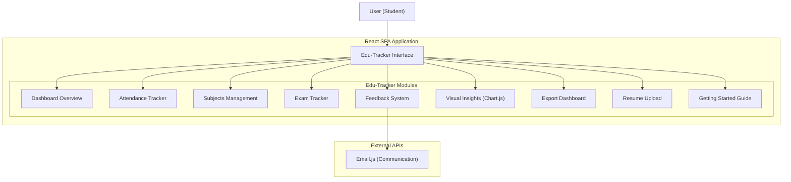

<div align="center">

# 📘 Edu-Tracker
### Exam & Attendance Management System

*A web-based academic tracker designed for students to manage their attendance, exams, subjects, and performance insights efficiently from a single interactive dashboard.*


</div>

---

# 📖 Overview

Students often struggle to keep track of their attendance percentages, upcoming exams, subject-wise progress, and academic performance data.

**Edu-Tracker** solves this by providing a centralized, visual, and easy-to-use system that keeps all academic information organized and accessible. It helps track attendance, subjects, exams, feedback, and performance insights—all from a single interactive dashboard.

---

# ✨ Features

- 📊 **Dashboard:** A unified dashboard that gives an overview of attendance, exams, subjects, and performance insights at a glance.
- 📅 **Attendance Tracker:** Track attendance for each subject and monitor overall attendance percentage to stay exam-ready.
- 📚 **Subjects Management:** Add, edit, and manage subjects with ease for better academic organization.
- 📝 **Exam Tracker:** Keep track of exams, schedules, and subject-wise exam details.
- 💬 **Feedback System:** Add and manage feedback related to subjects or exams for self-improvement.
- 📈 **Visual Insights:** Interactive bar graphs and charts using **Chart.js** to visualize academic performance and attendance trends.
- 📤 **Export Dashboard:** Export your dashboard data for record-keeping or sharing purposes.
- 📄 **Resume Upload:** Upload and store resumes directly within the platform for academic or placement readiness.
- 🚀 **Getting Started Guide:** A guided onboarding experience to help users understand and use the app effectively.

---

# 🏗 Architecture



---

# 🛠 Tech Stack

| Category | Technology | Purpose |
|----------|------------|---------|
| **Frontend Framework** | React | Core UI component logic |
| **Styling** | Tailwind CSS, HTML/CSS | Modern UI design, structure, and responsive layout |
| **Data Visualization** | Chart.js | Interactive bar graphs and charts |
| **Core Logic** | JavaScript | Client-side application behavior |
| **Communication** | Email.js | Handling email and feedback features |

---

# 📸 Screenshots

### 🏠 Dashboard Overview


---

### 📅 Attendance Tracker


---

### 📝 Exam Tracker


---

### 📈 Visual Insights


---

# ⚙️ Installation & Setup

## 1. Clone the repository
```bash
git clone https://github.com/Khushi1310-nayak/Edu-Tracker.git
cd Edu-Tracker
```

## 2. Install dependencies
```bash
npm install
```

## 3. Run the application
```bash
npm run dev
```

---

# 🚀 Future Enhancements

- **Authentication:** User authentication & profiles
- **Cloud Database:** Cloud storage for academic records
- **Alerts:** Notifications for exams & attendance alerts
- **Mobile First:** Mobile-responsive improvements
- **Advanced Metrics:** Advanced analytics & reports

---

# 🤝 Contributing

Contributions are welcome!

Feel free to fork the repository, create a feature branch, and submit a pull request.

---

# 📜 License

This project is licensed under the MIT License.

---

# 👩💻 Author

## **Manisa Nayak**

🎓 Student | Full-Stack Developer | AI Product Builder

Passionate about:
- Full-Stack Architecture
- User Experience (UI/UX)
- AI Automation & Product Building

### Connect with Me

**GitHub:** https://github.com/Khushi1310-nayak  
**LinkedIn:** https://www.linkedin.com/in/manisa-nayak-185bb5378/

---

## ⭐ If you found this project interesting, consider giving it a Star!
